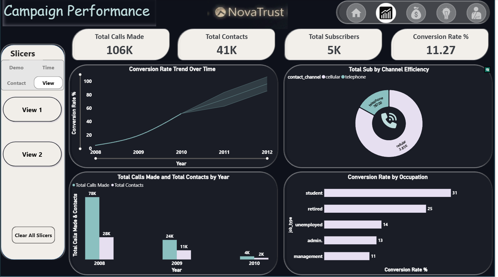
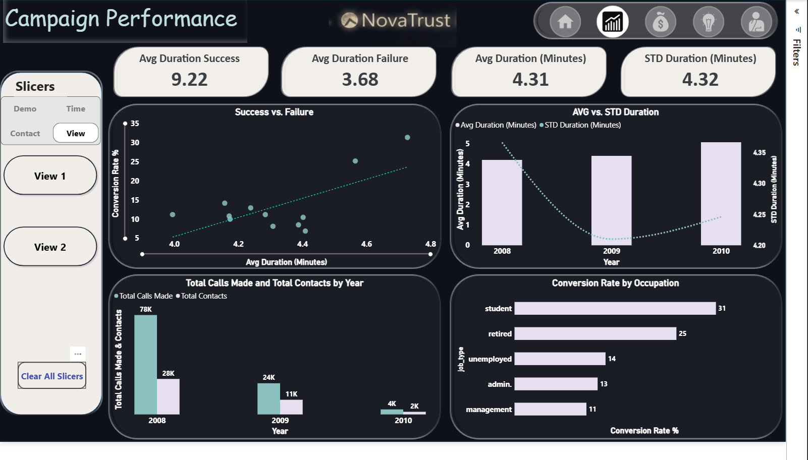
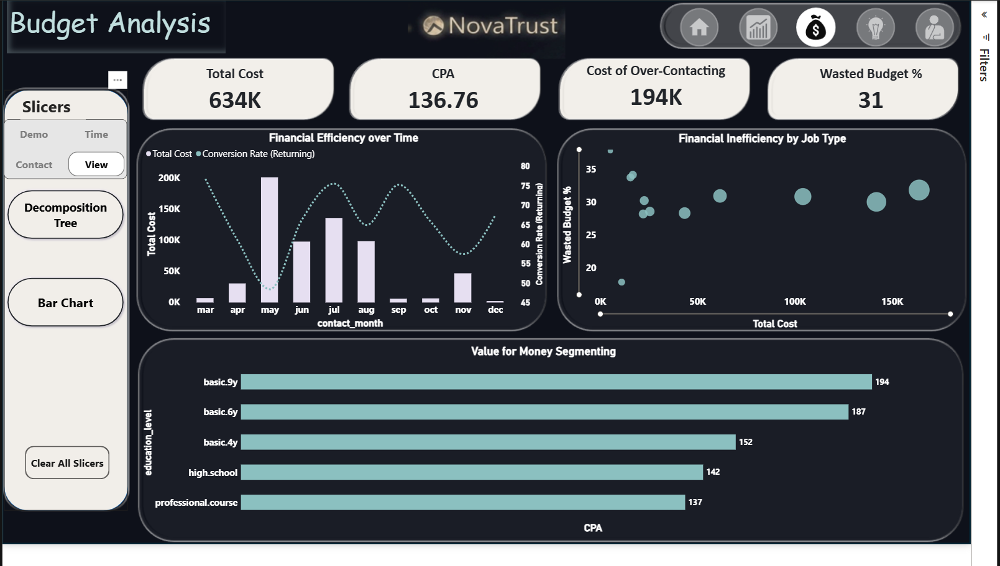
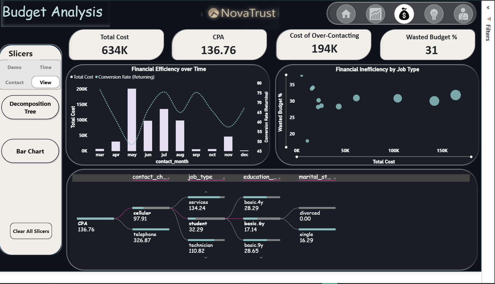
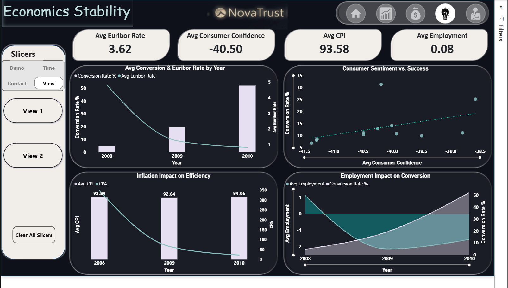
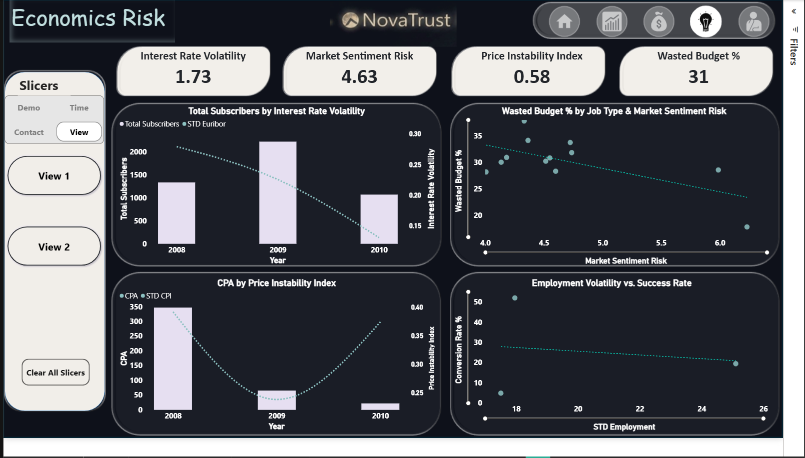
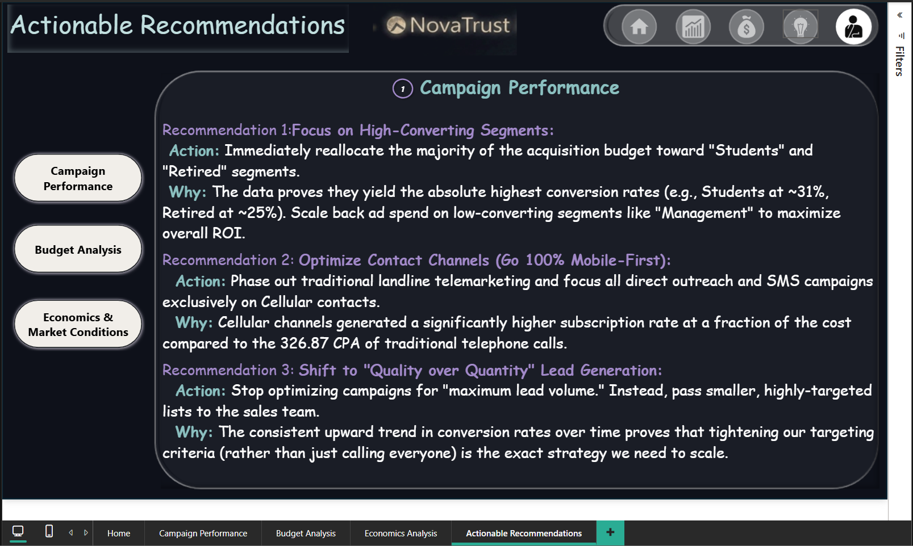
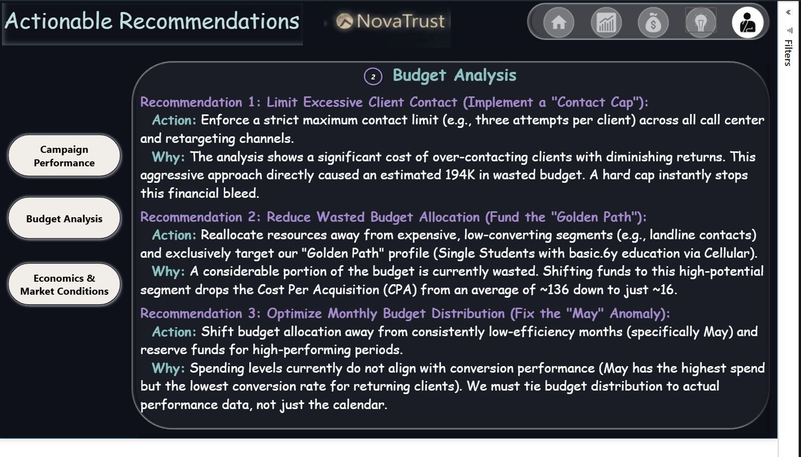
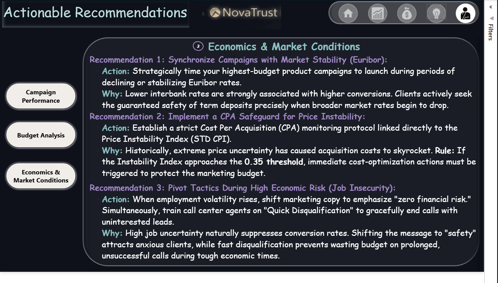

<div align="center">

<!-- Banner -->


# 🏦 NovaTrust — Bank Marketing Campaign Analytics

### 🥈 2nd Place — Project Hail Mary | Datathon Competition

<br/>


<br/>

> **A full-scale, multi-page Power BI analytics solution** built to dissect NovaTrust Bank's telemarketing campaign data — uncovering what drives term deposit subscriptions, where budget is wasted, and how market conditions shape outcomes.

</div>

---

## 📖 Table of Contents

- [🎯 Project Overview](#-project-overview)
- [📊 Dashboard Pages](#-dashboard-pages)
- [💡 Key Insights](#-key-insights)
- [🔧 Technical Architecture](#-technical-architecture)
- [✅ Actionable Recommendations](#-actionable-recommendations)
- [👥 Team](#-team)
- [🏆 Competition](#-competition)

---

## 🎯 Project Overview

NovaTrust Bank ran a large-scale telemarketing campaign to promote term deposits. This project delivers a **comprehensive Power BI analytics solution** that transforms raw call data into strategic business intelligence across three domains:

| Domain | Focus |
|---|---|
| 📈 **Campaign Performance** | Conversion rates, channel efficiency, occupational segments |
| 💰 **Budget Analysis** | CPA, wasted spend, financial inefficiency by segment |
| 📉 **Economics & Risk** | Euribor impact, consumer confidence, market volatility |

**Key Stats at a Glance:**

```
Total Calls Made  →  106,000      Total Contacts    →  41,000
Total Subscribers →  5,000        Conversion Rate   →  11.27%
Total Cost        →  634K         CPA               →  136.76
Wasted Budget     →  31%          Cost of Over-Contacting → 194K
```

---

## 📊 Dashboard Pages

### Page 1 — Campaign Performance (View 1)
> *Overall reach, conversion trends, and channel breakdown*



- **Conversion Rate Trend:** Steady upward climb from near-zero in 2008 to ~95% by 2012 — proving the strategy matures over time.
- **Channel Efficiency:** Cellular dominates with **3.85K subscribers** vs. Telephone at 787 — a 5:1 ratio.
- **Top Occupations:** Students (31%) and Retired (25%) lead all segments by conversion rate.

---

### Page 2 — Campaign Performance (View 2)
> *Call duration analysis and success/failure correlation*



- **Avg Duration — Success:** 9.22 min | **Failure:** 3.68 min → Quality conversations convert.
- **Success vs. Failure Scatter:** Clear positive correlation between call duration and conversion rate.

---

### Page 3 — Budget Analysis (View 1 — Value for Money)
> *Cost efficiency by education segment and monthly spending patterns*



- **Financial Efficiency over Time:** Spending peaked in May with the lowest returning conversion rate — a critical misalignment.
- **Value for Money by Education:** `basic.9y` leads with CPA of 194, followed by `basic.6y` at 187.

---

### Page 4 — Budget Analysis (View 2 — Decomposition Tree)
> *CPA breakdown by contact channel → job type → education → marital status*



- **Golden Path identified:** `Cellular → Student → basic.6y → Single` yields a CPA of only **~16** vs. the overall average of 136.76.
- **Worst Path:** `Telephone` contacts carry a CPA of **326.87** — more than 20× the golden path.

---

### Page 5 — Economics Stability
> *How Euribor rates, consumer confidence, CPI, and employment shape conversions*



- **Euribor inversely correlated** with conversions — clients flock to term deposits as interbank rates fall.
- **Consumer Sentiment vs. Success:** Positive trend — even mildly improving confidence lifts conversion.
- **Employment Impact:** Declining employment correlates with rising conversions as clients seek financial safety.

---

### Page 6 — Economics Risk
> *Volatility, market sentiment risk, and price instability index*



- **Interest Rate Volatility:** 1.73 — peaked in 2009 alongside highest subscriber counts, then normalized.
- **Price Instability Index:** Approaches the **0.35 critical threshold** in 2010, signaling CPA risk.
- **Wasted Budget × Market Sentiment:** Negative correlation — higher sentiment risk = lower wasted budget, suggesting campaigns get more selective.

---

### Page 7–9 — Actionable Recommendations
> *Three sections: Campaign, Budget, and Economics — each with 3 data-backed recommendations*





---

## 💡 Key Insights

### 🎯 Who Converts Best?
- **Students** convert at **31%** — the highest of any segment
- **Retired** individuals follow at **25%**
- Management and blue-collar segments underperform significantly

### 📱 Which Channel Wins?
- **Cellular** outperforms telephone by **~5:1** in total subscribers
- Telephone CPA is **326.87** — economically unsustainable
- Cellular CPA: **97.91** — nearly 3.4× more efficient

### 📅 When to Spend?
- **May** has the highest spend but the **lowest returning conversion rate**
- Budget should be redistributed toward months with proven performance

### 📞 How Long Should Calls Be?
- Successful calls average **9.22 minutes**
- Failed calls average **3.68 minutes**
- Calls under 5 minutes should be deprioritized or gracefully disqualified early

---

## 🔧 Technical Architecture

```
📁 NovaTrust_dt_final.pbix
│
├── 📄 Data Model
│   ├── Bank Marketing Dataset (UCI ML Repository)
│   ├── Economic Indicators (Euribor, CPI, Employment, Consumer Confidence)
│   └── Calculated Columns & Measures (DAX)
│
├── 📊 DAX Measures
│   ├── Conversion Rate % = DIVIDE(Subscribers, Total Contacts) * 100
│   ├── CPA = Total Cost / Total Subscribers
│   ├── Wasted Budget % = Cost of Over-Contacting / Total Cost * 100
│   ├── Avg Duration (Minutes) = AVERAGE(duration) / 60
│   ├── Interest Rate Volatility = STDEV(euribor3m)
│   ├── Market Sentiment Risk = STDEV(cons.conf.idx) * -1
│   └── Price Instability Index = STDEV(cons.price.idx)
│
├── 🎨 Design System
│   ├── Dark theme (#1a1a2e base)
│   ├── Teal (#4ECDC4) + Lavender (#C8B8E8) accent palette
│   ├── Rounded card containers with subtle borders
│   └── Consistent slicer panel (Demo / Time / Contact / View toggles)
│
└── 🔗 Navigation
    ├── Home page with icon-based nav bar
    ├── Cross-page slicers (synced filters)
    └── Drill-through on Actionable Recommendations
```

### Slicer System

| Slicer Group | Options |
|---|---|
| **Demo** | Filter by demographic attributes |
| **Time** | Year, Month, Quarter |
| **Contact** | Contact channel, contact month |
| **View** | Toggle between View 1 / View 2 per page |

---

## ✅ Actionable Recommendations

### 1. Campaign Performance

| # | Recommendation | Action |
|---|---|---|
| 1 | **Focus on High-Converting Segments** | Reallocate budget toward Students & Retired; pull back from Management |
| 2 | **Go 100% Mobile-First** | Phase out landline telemarketing; shift to Cellular-only outreach |
| 3 | **Quality over Quantity** | Pass smaller, highly-targeted lists — tighter criteria = higher ROI |

### 2. Budget Analysis

| # | Recommendation | Action |
|---|---|---|
| 1 | **Implement a Contact Cap** | Max 3 contact attempts per client to eliminate the 194K wasted spend |
| 2 | **Fund the Golden Path** | Target Single Students, basic.6y education, via Cellular → CPA drops from 136 → ~16 |
| 3 | **Fix the May Anomaly** | Reallocate May's budget to high-performance months |

### 3. Economics & Market Conditions

| # | Recommendation | Action |
|---|---|---|
| 1 | **Synchronize with Euribor** | Launch highest-budget campaigns during declining/stabilizing Euribor periods |
| 2 | **CPA Safeguard Protocol** | Trigger cost-optimization when Price Instability Index approaches **0.35** |
| 3 | **Pivot Messaging During Job Insecurity** | Emphasize "zero financial risk" copy; use Quick Disqualification for uninterested leads |

---

## 👥 Team

<div align="center">

**🚀 Project Hail Mary**

| Member | Role |
|---|---|
| **Mina Magdy** | Data Analysis & Dashboard Architecture |
| **Ahmed Shehab** | Data Analysis & Visualization |
| **Shahd Yousery** | Data Analysis & Insights |
| **Malak Abdelkader** | Data Analysis & Recommendations |

</div>

---

## 🏆 Competition

<div align="center">

```
🏆  Datathon Competition
🥈  Final Standing: 2nd Place
🎯  Team Name: Project Hail Mary
📊  Solution: Multi-page Power BI Dashboard
```

We competed against multiple teams in a data analytics challenge centered on real-world bank marketing data. Our solution stood out for its **depth of analysis**, **economic context integration**, and **actionable business recommendations** — earning us 2nd place.

</div>

---

## 📁 Repository Structure

```
NovaTrust-Datathon/
│
├── 📊 NovaTrust_dt_final.pbix       ← Main Power BI file
├── 📄 README.md                      ← You are here
│
└── 📸 screenshots/
    ├── campaign_performance_v1.png
    ├── campaign_performance_v2.png
    ├── budget_analysis_v1.png
    ├── budget_analysis_v2.png
    ├── economics_stability.png
    ├── economics_risk.png
    ├── recommendations_campaign.png
    ├── recommendations_budget.png
    └── recommendations_economics.png
```

---

<div align="center">

**Built with 💙 by Team Project Hail Mary**

*NovaTrust Datathon — 2nd Place 🥈*

</div>
